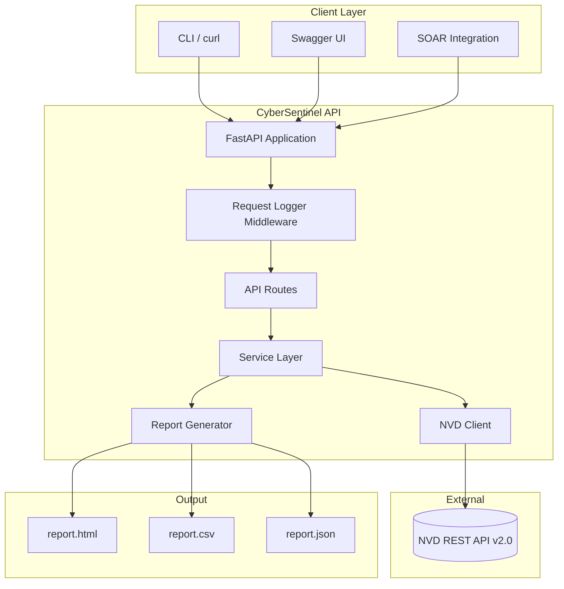

<p align="center">
  
  
  
  
</p>

<h1 align="center">🛡️ CyberSentinel</h1>

<p align="center">
  <strong>Production-ready Cybersecurity Threat Intelligence API</strong><br>
  Search NVD vulnerabilities, assess severity, and generate multi-format intelligence reports.
</p>

---

## 📋 Project Description

**CyberSentinel** is an internal-grade cybersecurity threat intelligence platform built with Python and FastAPI. It integrates with the official [National Vulnerability Database (NVD)](https://nvd.nist.gov/) API to retrieve real-time CVE data and produces actionable intelligence reports in HTML, CSV, and JSON formats.

Designed for security operations teams, vulnerability management workflows, and automated threat intelligence pipelines.

---

## 🏗 Architecture



```
┌─────────────┐     ┌──────────────────────────────────────┐     ┌─────────────┐
│   Client    │────▶│         CyberSentinel API            │────▶│  NVD API    │
│ (HTTP/REST) │     │  ┌─────────┐  ┌──────────┐           │     │  (NIST)     │
└─────────────┘     │  │ Routes  │─▶│ Services │─▶ NVD Client│     └─────────────┘
                    │  └─────────┘  └────┬─────┘           │
                    │                    │                 │
                    │              ┌─────▼─────┐           │
                    │              │  Reports  │           │
                    │              │ HTML/CSV/ │           │
                    │              │   JSON    │           │
                    │              └───────────┘           │
                    └──────────────────────────────────────┘
```

---

## 📁 Folder Structure

```
CyberSentinel/
├── .github/
│   └── workflows/
│       └── python.yml          # CI pipeline
├── app/
│   ├── __init__.py
│   ├── api.py                  # FastAPI routes & middleware
│   ├── models.py               # Pydantic schemas
│   ├── nvd.py                  # NVD API client
│   ├── report.py               # Report generation
│   ├── services.py             # Business logic layer
│   └── utils.py                # Logging utilities
├── reports/                    # Generated reports output
├── templates/
│   └── report.html             # Jinja2 HTML template
├── tests/
│   └── test_api.py             # Pytest test suite
├── .env.example
├── .gitignore
├── app.py                      # Application entry point
├── config.py                   # Environment configuration
├── docker-compose.yml
├── Dockerfile
├── README.md
└── requirements.txt
```

---

## 🚀 Installation

### Prerequisites

- Python 3.12+
- pip
- (Optional) Docker & Docker Compose

### Local Setup

```bash
# Clone the repository
git clone https://github.com/your-org/CyberSentinel.git
cd CyberSentinel

# Create virtual environment
python -m venv venv

# Activate virtual environment
# Windows
venv\Scripts\activate
# Linux / macOS
source venv/bin/activate

# Install dependencies
pip install -r requirements.txt

# Configure environment
cp .env.example .env
```

---

## ▶️ Running

### Development Server

```bash
python app.py
```

Or with Uvicorn directly:

```bash
uvicorn app.api:app --host 0.0.0.0 --port 8000 --reload
```

### Docker

```bash
cp .env.example .env
docker-compose up --build
```

The API will be available at **http://localhost:8000**

---

## 📖 Swagger / OpenAPI

FastAPI automatically generates interactive API documentation:

| Documentation | URL |
|---------------|-----|
| Swagger UI    | http://localhost:8000/docs |
| ReDoc         | http://localhost:8000/redoc |
| OpenAPI JSON  | http://localhost:8000/openapi.json |

---

## 🔌 API Endpoints

### `GET /`

Returns application status.

```json
{
  "application": "CyberSentinel",
  "status": "running"
}
```

### `GET /health`

Health check endpoint.

```json
{
  "status": "UP"
}
```

### `POST /cve/search`

Search NVD for vulnerabilities by keyword.

**Request:**

```json
{
  "keyword": "apache"
}
```

**Response:**

```json
{
  "keyword": "apache",
  "total_results": 10,
  "results": [
    {
      "cve_id": "CVE-2024-XXXXX",
      "description": "Vulnerability description...",
      "severity": "HIGH",
      "cvss_score": 7.5,
      "published_date": "2024-01-15T10:00:00.000"
    }
  ]
}
```

### `POST /report`

Generate HTML, CSV, and JSON reports from search results.

**Request:**

```json
{
  "keyword": "apache",
  "results": [
    {
      "cve_id": "CVE-2024-XXXXX",
      "description": "Vulnerability description...",
      "severity": "HIGH",
      "cvss_score": 7.5,
      "published_date": "2024-01-15T10:00:00.000"
    }
  ]
}
```

**Response:**

```json
{
  "success": true,
  "message": "Report generated successfully with 1 vulnerabilities.",
  "report_id": "report_apache_20240626_120000_a1b2c3d4",
  "files": {
    "html": "/app/reports/report_apache_20240626_120000_a1b2c3d4.html",
    "csv": "/app/reports/report_apache_20240626_120000_a1b2c3d4.csv",
    "json": "/app/reports/report_apache_20240626_120000_a1b2c3d4.json"
  }
}
```

---

## 🖼 Screenshots

> Placeholder — add screenshots after running locally.

| Swagger UI | Threat Report |
|:----------:|:-------------:|
|  |  |

---

## 🧪 Testing

```bash
pytest tests/ -v
```

---

## 🔮 Future Improvements

- [ ] API key authentication and RBAC
- [ ] Redis caching for NVD query results
- [ ] Scheduled vulnerability scanning with Celery
- [ ] MITRE ATT&CK framework mapping
- [ ] Email/Slack alert notifications
- [ ] CVE trend analytics dashboard
- [ ] Rate limiting and request throttling
- [ ] PostgreSQL persistence for historical reports
- [ ] Integration with Shodan, VirusTotal, and OTX feeds

---

## 📄 License

This project is licensed under the **MIT License**.

```
MIT License

Copyright (c) 2024 CyberSentinel

Permission is hereby granted, free of charge, to any person obtaining a copy
of this software and associated documentation files (the "Software"), to deal
in the Software without restriction, including without limitation the rights
to use, copy, modify, merge, publish, distribute, sublicense, and/or sell
copies of the Software, and to permit persons to whom the Software is
furnished to do so, subject to the following conditions:

The above copyright notice and this permission notice shall be included in all
copies or substantial portions of the Software.

THE SOFTWARE IS PROVIDED "AS IS", WITHOUT WARRANTY OF ANY KIND, EXPRESS OR
IMPLIED, INCLUDING BUT NOT LIMITED TO THE WARRANTIES OF MERCHANTABILITY,
FITNESS FOR A PARTICULAR PURPOSE AND NONINFRINGEMENT. IN NO EVENT SHALL THE
AUTHORS OR COPYRIGHT HOLDERS BE LIABLE FOR ANY CLAIM, DAMAGES OR OTHER
LIABILITY, WHETHER IN AN ACTION OF CONTRACT, TORT OR OTHERWISE, ARISING FROM,
OUT OF OR IN CONNECTION WITH THE SOFTWARE OR THE USE OR OTHER DEALINGS IN THE
SOFTWARE.
```
